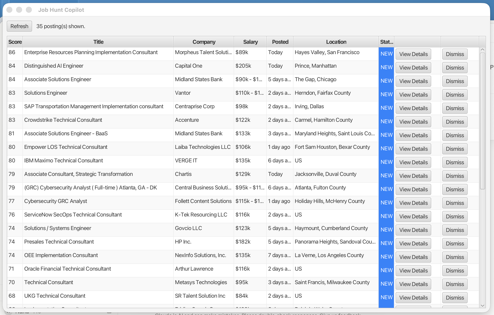
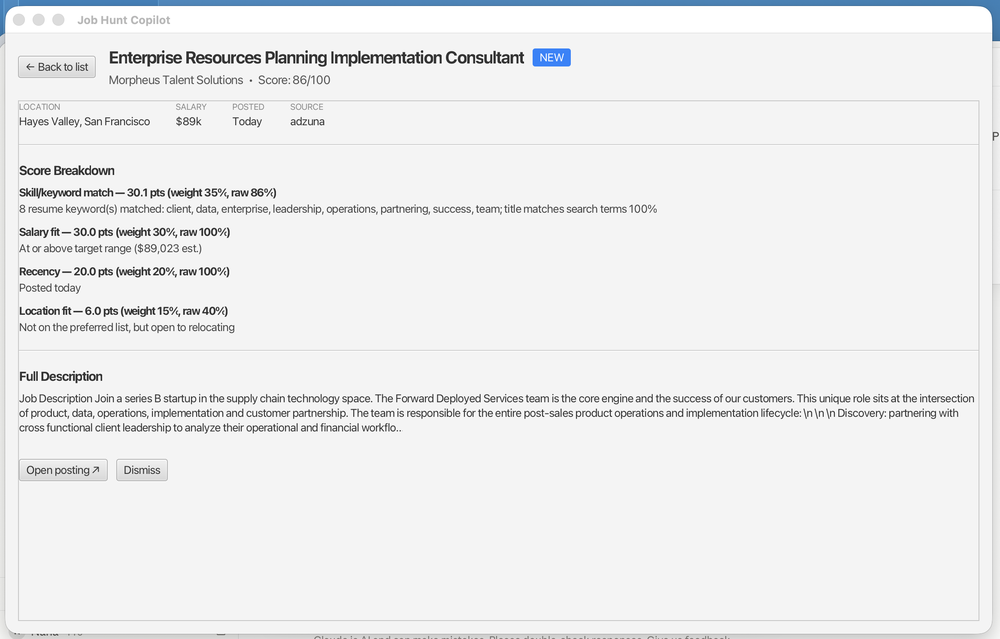

# Job Hunt Copilot

A local desktop app that searches for job postings matching a target list of roles, scores and ranks them by fit, lets me review each posting side-by-side with an AI-tailored version of my resume, and lets me trigger the actual application myself after reviewing it. **It never applies on its own** — every application is human-reviewed and human-submitted.

Built as a personal project to solve my own job search and to learn Java/software architecture along the way — so it's built in small, understandable phases rather than one big drop.

## Why this exists

Job hunting means the same repetitive loop over and over: search several job boards for the same handful of role titles, skim postings to see if they're worth a look, hand-tailor a resume for the ones that are, then fill out the same eligibility/demographic questions on a slightly different form each time. This app automates the tedious, mechanical parts of that loop (searching, scoring, tailoring, form-filling) while keeping a human in the loop for every judgment call — nothing gets submitted without me reading it first.

## Current status: Phase 8 — Semi-automated apply flow (Greenhouse/Lever)

The detail view now has an **Apply** button, gated on a tailored resume and cover letter already existing for the posting. Clicking it launches a real, visible browser via Selenium, navigates to the posting, detects whether it's a Greenhouse or Lever application form, and fills in whatever it can confidently recognize from `config/profile.json` — uploading the tailored resume/cover letter along the way. It never clicks Submit. Every field it filled (or deliberately left blank) shows up on a review screen before anything else happens, and the actual submission is always a human clicking the real Submit button in the browser. See [Semi-automated apply flow](#semi-automated-apply-flow) below for the field-recognition strategy and the no-fabrication guarantees.




## Tech stack

- **Language:** Java 17
- **GUI:** JavaFX 21 (`org.openjfx:javafx-controls`/`-graphics`/`-base`)
- **Local storage:** SQLite via JDBC (`org.xerial:sqlite-jdbc`)
- **Config parsing:** Gson (reads `config/roles.json` and `config/blocklist.json`)
- **HTTP:** `java.net.http.HttpClient` (built into the JDK, no extra dependency)
- **Resume tailoring & cover letter generation:** Claude API (Anthropic), official `com.anthropic:anthropic-java` SDK, model `claude-opus-4-5`
- **Resume/cover letter format:** LaTeX (`.tex`) compiled to PDF via [Tectonic](https://tectonic-typesetting.github.io/)
- **Browser automation for applying:** Selenium WebDriver (`org.seleniumhq.selenium:selenium-java`), Selenium Manager for driver binaries, Chrome
- **Build tool:** Maven

## Job data sources

**Adzuna API** is live (Phase 2). USAJobs and the Greenhouse/Lever public job board APIs are planned for later phases. Deliberately **not** scraping LinkedIn or Indeed — both prohibit automated scraping and bot-driven applications in their Terms of Service.

Adzuna's free tier is ~1,000 calls/month (~33/day), so the fetcher is careful with it: one page per search term (~6 calls per full run), and a 6-hour cooldown that skips re-fetching a term if it was already queried recently. Every call is logged to the `api_calls` table so quota usage is visible over time.

## Scoring

Every posting gets a 0-100 score, computed as four weighted factors (weights live in `config/roles.json` and are configurable):

| Factor | Weight | What it measures |
|---|---|---|
| Skill/keyword match | 35% | Resume keyword overlap (real words extracted from `base_resume.tex`) + job title vs. configured search terms |
| Salary fit | 30% | Posting's salary vs. my minimum acceptable ($80k) and target range ($85k-90k+) |
| Recency | 20% | Linear decay from 1.0 (posted today) to 0.0 (at the 14-day cutoff) |
| Location fit | 15% | Remote, or a preferred metro (VA/MD/NC/TX/DC/Atlanta/Seattle/FL) scores highest; anywhere else still scores reasonably, since I'm open to relocating |

The keyword matcher doesn't use a hand-maintained skills list — it strips `base_resume.tex` down to plain text (stripping LaTeX commands, keeping visible content) and tokenizes the whole thing, so the resume file stays the single source of truth. Nothing is a hard filter here: a posting below my salary floor or outside my preferred metros still gets scored and shown, just lower — dismissing is a manual decision (Phase 4+), not something the scorer does for me.

Every score comes with a breakdown, not just the number — see `ScoreFactor`/`ScoreBreakdown` in `src/main/java/com/jobhuntcopilot/score/`. The list view shows the total; the detail view (below) shows the full per-factor breakdown.

## Eligibility filtering

Added after Phase 4, since real fetched data made it obvious some results were things I'm simply not eligible for as a recent grad — not "lower fit," genuinely not eligible. These are hard excludes, not scoring penalties, and use the same fetch-time-plus-list-load-time pattern as the company blocklist (see `EligibilityFilter` in `src/main/java/com/jobhuntcopilot/eligibility/`):

| Check | Excludes | Configurable in `config/roles.json` |
|---|---|---|
| Seniority title | Titles containing Senior, Sr., Lead, Principal, Staff, Manager, Director, Head of, VP, Chief, etc. | `eligibility.excludedTitleKeywords` |
| Years of experience | Descriptions requiring more than N years (default 2) | `eligibility.maxYearsExperience` |
| Active clearance | "must possess an active Secret clearance" — but *not* "eligible to obtain a clearance," which is normal language for entry-level GRC roles | Not configurable (parsing logic, not a preference) |

Every exclusion is logged to the `eligibility_exclusions` table — source, title, company, reason, and the matched keyword/snippet — durable and queryable specifically so the filtering can be spot-checked for over-filtering rather than trusted blindly. It's idempotent (`INSERT OR IGNORE` on a unique posting key), so re-loading the list doesn't spam duplicate rows for something already excluded.

## List view

The list is a ranked, scrollable table — score, title, company, salary, days since posted, location, and a status badge — with a **View Details** button per row (double-clicking a row does the same thing) and a **Dismiss** button that hides a posting from the default view for good (it's still in the database, just filtered out). **Refresh** re-runs the Adzuna fetch on a background thread so the window stays responsive while it's making network calls, then rescores and reloads the table. Company-blocklist filtering happens twice: once at fetch time (so a blocklisted company is never even stored) and again when the list loads (so adding a company to the blocklist retroactively hides anything already stored from them).

## Detail view

Opening a posting (from the list) swaps to a full detail view in the same window — no second window to manage, `MainView` just swaps what's in the center of the layout. It shows:

- **Full score breakdown** — every `ScoreFactor` with its points, weight, raw percentage, and the plain-language explanation behind it (which resume keywords matched, why the salary/location/recency scored the way they did).
- **Metadata** — location, salary, posted date, source.
- **The full job description.**
- **Open posting ↗** — opens the original listing in the system browser via JavaFX's `HostServices`.
- **Dismiss** — same hard-hide behavior as the list view's Dismiss button, then returns to the list.

Opening the detail view advances a NEW posting to VIEWED (never overwrites APPLIED or DISMISSED) — `JobPipeline.markViewed()`, called before the view is even constructed, so the view itself stays free of that side effect.

**Apply** (Phase 8) launches the semi-automated apply flow — see [Semi-automated apply flow](#semi-automated-apply-flow) below. It's disabled until a tailored resume and cover letter both exist for this posting.

## Resume tailoring

Clicking **Tailor Resume for This Posting** (only for postings actually opened in detail view — never for every fetched posting, so it doesn't burn API calls on postings I never look at) runs this pipeline:

1. **Parse** `base_resume.tex` (`ResumeParser`) into the two sections that are ever eligible for tailoring — Experience and Technical Projects bullets — plus everything else (preamble, header, Education, Certifications, Technical Skills, Leadership, and every entry's own title/dates/employer line) captured and passed through byte-for-byte, untouched.
2. **Ask Claude** (`ClaudeResumeTailor`, model `claude-opus-4-5`) to reorder/reword/drop bullets to surface keywords from the posting. Claude is never shown job titles, employers, dates, degree, GPA, or certifications — those aren't part of the request at all, so they can't be changed no matter what Claude does. It's also never shown LaTeX — bullet text is unescaped to plain text before it's sent and re-escaped after, so a rewording can't corrupt a `\&`/`\%`/`\$` escape sequence.
3. **Validate** the response: every bullet ID Claude returns must trace back to a real bullet already in `base_resume.tex` — there's no way for a bullet to appear that isn't a reordering/rewording of something already there. Missing or unrecognized IDs, or an entry left with zero bullets, fail loudly rather than silently dropping content.
4. **Reassemble** (`ResumeAssembler`) the tailored LaTeX from the original document plus Claude's plan, then **compile** to PDF via Tectonic. If the result overflows to a second page, the lowest-priority project (by Claude's own ordering) is dropped and it recompiles, up to a bounded number of attempts, rather than shrinking formatting or breaking the one-page layout.
5. **Cache** the result per posting (`tailored_resumes` table) so reopening the same posting's detail view doesn't re-call Claude.
6. **Show a diff** — every reworded, reordered, or dropped bullet/project, with Claude's stated reason, right next to a button that opens the compiled PDF — so nothing gets used without being checked first. A lightweight heuristic (`FabricationHeuristic`) also flags any number (count, percentage, dollar amount) that appears in a reworded bullet but wasn't in the original, as an extra signal to double-check before trusting a rewording.

## Cover letter generation

Clicking **Generate Cover Letter for This Posting** runs the same shape of pipeline as resume tailoring, reusing the same Claude API key, `TectonicCompiler`, and `PdfPageCounter` — but the unit of content is a *paragraph*, not a *bullet*, since a cover letter is prose rather than a bulleted list:

1. **Parse** `base_cover_letter.tex` (`CoverLetterParser`) into an opening paragraph, a list of headed body paragraphs (e.g. "Technical Impact and Systems Development"), and a closing paragraph — everything else (name/contact header, salutation, signature block, and every body paragraph's `\textbf{...}` heading) is captured and passed through byte-for-byte, untouched.
2. **Ask Claude** (`ClaudeCoverLetterWriter`, model `claude-opus-4-5`) to reword the opening/closing for keyword alignment, and to reorder, reword, and optionally drop *one* body paragraph to prioritize whatever's most relevant to the posting. Claude never sees the header/salutation/signature block, and — same as resume tailoring — never sees LaTeX: paragraph text is unescaped to plain text before it's sent and re-escaped after, so a rewording can't corrupt a `\&`/`\%`/`\$` escape sequence.
3. **Validate** the response the same way: every paragraph ID (opening, each body paragraph, closing) must be explicitly accounted for, opening/closing can never be dropped or reordered away from first/last, and at least one body paragraph must survive.
4. **Reassemble** (`CoverLetterAssembler`) and **compile** to PDF via Tectonic, dropping the lowest-priority body paragraph and recompiling (bounded attempts) if it overflows to a second page — same trim-and-retry pattern as resume tailoring.
5. **Cache** per posting (`cover_letters` table) and **show a diff**, same as resume tailoring — reworded/reordered/dropped paragraphs with Claude's stated reason, plus the same `FabricationHeuristic` new-number check, next to a button that opens the compiled PDF.

`resources/base_cover_letter.tex` is my actual cover letter, not a placeholder — every fact in it (degree, certification, scholar program, employers, projects) is real, same trust boundary as `base_resume.tex`: Claude may re-emphasize and reorder what's already there, never add to it.

## Semi-automated apply flow

Clicking **Apply** (only enabled once a tailored resume and cover letter already exist for this posting — clicking Apply never silently triggers those Claude calls itself) runs this pipeline:

1. **Launch a visible browser** (`ApplyFlowService`, via Selenium/ChromeDriver — not headless, so I can see exactly what's happening) and navigate to the posting's URL.
2. **Detect the ATS** (`AtsDetector`) from the loaded page's URL and DOM — Greenhouse or Lever only for now, per the roadmap. Anything else is `UNKNOWN`: the browser stays open on the page, but nothing gets auto-filled — I apply manually there.
3. **Scan the form** (`GreenhouseFormScanner`/`LeverFormScanner`) into a flat list of fields — label text, input type, and (for selects/radios) the literal option text on *this* form, since EEO option wording varies slightly by posting.
4. **Resolve every field** (`FieldMatcher`, then `ClaudeFieldInterpreter` as fallback) against `config/profile.json` — the exact two-pass strategy: keyword/pattern matching first (name, email, work authorization, EEO category questions, resume/cover-letter file uploads, matched against this form's real option wording via synonym patterns), and Claude only for label wording the patterns don't recognize. Claude is only ever allowed to pick from the enumerated list of my real profile answers it's given — it can't author new answer text, and it's never asked to compose a response to an open-ended question. **Any field neither pass can confidently resolve is left blank and flagged** — this is the same rule for every field, but it matters most for EEO/demographic ones, where a wrong guess is worse than a blank.
5. **Fill the live browser** (`ApplicationFormFiller`) with everything resolved, uploading the tailored resume/cover letter PDFs to their file inputs. This class has no method that locates or clicks anything resembling a Submit control — that's a deliberate omission in the code, not a runtime check, the same "guardrail via structure" pattern the resume/cover-letter Claude integrations use for entry headers.
6. **Log the attempt** (`apply_attempts` table via `ApplyAttemptRepository`) — ATS type, URL, every field found/filled/flagged as JSON, and an outcome that starts at `PREPARED` (or `UNSUPPORTED_ATS`/`FAILED`).
7. **Show the review screen** — every field, its filled value (or why it was left blank), before anything else is possible. Only from there do **"I Submitted It"** / **"I Didn't Submit It"** buttons appear, which is how the app ever finds out what happened — it can't observe a real submission on an external site itself. `ApplyFlowService` never calls `driver.quit()` on any path, so the browser stays open and under my control from the moment it launches; the only way an application is actually submitted is me clicking the real Submit button myself.

`config/profile.json` (gitignored, real personal data — see `config/profile.example.json` for the shape) holds the answers: name/contact info, work authorization, and voluntary EEO self-identification (disability, veteran, race/ethnicity). Any category left out of the file (I didn't configure a gender-identity answer) is treated as unconfigured, not guessed — a form field for it goes through the same blank-and-flag path as any other unrecognized field.

**Not yet live-tested against a real posting.** Everything above is unit/integration-tested without touching a browser or a live site (see `ApplyFlowServiceTest`, which fakes only the one Selenium-touching method). The Greenhouse/Lever DOM selectors are built from documented structure, not verified against a real, current page — that's a deliberate next step done together on one real, low-stakes posting before this touches anything I actually care about, not something to silently "live-verify" solo the way the Claude-only phases were.

## Project layout

```
job-hunt-copilot/
├── config/
│   ├── roles.json                   # Search terms, location/remote pref, recency rule, scoring weights
│   ├── blocklist.json               # Companies to filter out before scoring
│   ├── profile.example.json         # Documents the shape of profile.json — copy and fill in
│   └── profile.json                 # My real personal/EEO answers for form-filling (gitignored)
├── resources/
│   ├── base_resume.tex              # My base LaTeX resume — source of truth for all tailored versions
│   └── base_cover_letter.tex        # My base LaTeX cover letter — source of truth for all tailored versions
├── docs/
│   └── *.png                        # Screenshots used in this README
├── src/
│   ├── main/
│   │   ├── java/com/jobhuntcopilot/
│   │   │   ├── Main.java            # JavaFX entry point (Application)
│   │   │   ├── config/              # Config records, ConfigLoader (Gson), EnvLoader (.env parsing)
│   │   │   ├── model/               # Job, JobStatus
│   │   │   ├── db/                  # Database (schema init), JobRepository, ApiCallRepository
│   │   │   ├── fetch/               # AdzunaClient, JobFetchService, FetchSummary
│   │   │   ├── text/                # Tokenizer — shared keyword tokenization
│   │   │   ├── resume/              # LatexTextExtractor, ResumeKeywordExtractor, ResumeParser, ResumeAssembler
│   │   │   ├── score/                # KeywordMatcher, *Scorer classes, ScoringEngine, ScoreBreakdown
│   │   │   ├── eligibility/          # SeniorityTitleFilter, ExperienceRequirementParser, ClearanceFilter
│   │   │   ├── tailor/              # ClaudeResumeTailor, ResumeTailoringService, TectonicCompiler, PdfPageCounter, FabricationHeuristic
│   │   │   ├── coverletter/         # CoverLetterParser, CoverLetterAssembler, ClaudeCoverLetterWriter, CoverLetterGenerationService
│   │   │   ├── apply/               # AtsDetector, Greenhouse/LeverFormScanner, FieldMatcher, ClaudeFieldInterpreter, ApplicationFormFiller, ApplyFlowService
│   │   │   ├── pipeline/            # JobPipeline — non-UI fetch/score/dismiss/tailor/cover-letter/apply orchestration
│   │   │   └── gui/                 # MainView (navigation), JobListView, JobDetailView, shared formatting
│   │   └── resources/
│   │       └── schema.sql           # SQLite DDL: jobs, api_calls, eligibility_exclusions, tailored_resumes, cover_letters, apply_attempts tables
│   └── test/java/com/jobhuntcopilot/   # Mirrors main/ — one test class per component above
├── .env.example                     # Template for API keys — copy to .env and fill in (gitignored)
├── .gitignore
└── pom.xml
```

`data/jobhunt.db` (the actual SQLite file), `data/tailored-resumes/` (compiled tailored-resume PDFs), and `data/cover-letters/` (compiled cover-letter PDFs) are created on first run and gitignored — local runtime state, not source.

## How to run it locally

Requires Java 17+, Maven, [Tectonic](https://tectonic-typesetting.github.io/) on `PATH` (for resume tailoring and cover letter generation — `brew install tectonic` on macOS), and Chrome installed (for the apply flow — Selenium Manager resolves the matching driver automatically, no separate install needed).

1. Copy `.env.example` to `.env` and fill in `ADZUNA_APP_ID` / `ADZUNA_APP_KEY` (free from [developer.adzuna.com](https://developer.adzuna.com/)) and `ANTHROPIC_API_KEY` (from [console.anthropic.com](https://console.anthropic.com/)) for resume tailoring and cover letter generation.
2. Copy `config/profile.example.json` to `config/profile.json` and fill in real personal/work-authorization/EEO answers for the apply flow — gitignored, never committed.
3. Run it:

```bash
mvn clean test         # build + run tests (no network calls, no quota used)
mvn compile exec:java  # opens the app window
```

The window opens showing whatever's already in `data/jobhunt.db` (instant, no network call). Click **Refresh** to fetch postings for every search term in `config/roles.json` — it filters out anything blocklisted or older than 14 days, dedupes against what's already stored, then rescores and reloads the table. Refreshing within 6 hours of the last fetch for a given term skips it instead of re-querying.

### Editing the config

`config/roles.json` and `config/blocklist.json` are meant to be hand-edited as my search evolves — no code changes needed to add a role, tweak a scoring weight, add a preferred metro, adjust the eligibility rules, or block a company. `config/profile.json` is edited less often (personal/work-authorization/EEO answers don't change frequently) but follows the same pattern — see `config/profile.example.json` for its shape.

## Roadmap

- [x] **Phase 0** — Repo setup: Maven skeleton, `.gitignore`, README, GitHub repo
- [x] **Phase 1** — Config + data layer: roles/scoring config, SQLite schema, `Job` model
- [x] **Phase 2** — Job fetching: Adzuna client, 14-day filter, dedupe, quota logging
- [x] **Phase 3** — Scoring engine: keyword match, salary, recency, location fit
- [x] **Phase 4** — GUI list view
- [x] **Phase 5** — GUI detail view
- [x] **Phase 6** — Resume tailoring (Claude API + LaTeX→PDF)
- [x] **Phase 7** — Cover letter generation
- [ ] **Phase 8** — Semi-automated apply flow (Greenhouse/Lever first)
- [ ] **Phase 9** — Application history + CSV export
- [ ] **Phase 10** — Polish: error handling, more tests, screenshots, demo GIF

## What I learned — Phase 8

This phase is the first one that acts on a real external site instead of just producing a file, and the design choices mostly follow from that shift. The field-recognition strategy (`FieldMatcher`, then `ClaudeFieldInterpreter` as fallback) mirrors the exact "no fabrication" structure from Phases 6/7 applied to a different kind of content: instead of "every returned bullet ID must trace back to a real bullet," it's "every field Claude resolves must come from an enumerated list of my real profile answers I handed it, never text it invents" — and instead of dropping a bullet when unsure, the equivalent move is leaving a field blank and flagging it. Getting the EEO fields right needed one more layer than the resume/cover-letter work did, though: a form's actual option wording ("Black or African American (Not Hispanic or Latino)") varies per posting, so matching against a canonical string never works — `FieldMatcher` resolves my configured answer (an enum) to a *category*, then searches this specific form's real option text for a synonym match, which is the same "match against the real thing in front of you, not an assumption" instinct that drove the EEO synonym patterns in the first place.

The other real design decision was making the one Selenium-touching step swappable for tests, the same way `FakeClaudeResumeTailor`/`FakeClaudeCoverLetterWriter` let Phase 6/7's orchestration tests run without a live API key. `ApplyFlowService.launchAndScan(url)` is the only method that touches a real `ChromeDriver` — everything downstream (field resolution, filling, attempt logging) runs for real in `ApplyFlowServiceTest` against a fake that returns canned scan results, so the "detect → scan → match → fill → log" sequence and the unsupported-ATS short-circuit are actually exercised, not just eyeballed.

The honest gap, and the reason this phase's README section says "not yet live-tested": the `GreenhouseFormScanner`/`LeverFormScanner` selectors are built from documented platform structure, not verified against a real, current page, and I deliberately didn't try to "live-verify" this one solo the way I did the Claude API calls in Phases 6/7 — an unsupervised run here would mean an actual browser hitting an actual company's site, which is a different order of side effect than a Claude API call. The plan going in was explicit about this: build and test everything that can be tested without a browser, then walk through one real, low-stakes posting together before this ever touches a job I actually care about. That walkthrough is the next step, not a formality — it's genuinely where a selector mismatch specific to a real form's current DOM would get caught.

## What I learned — Phase 7

This phase was mostly a story of a Phase 6 lesson paying for itself: before writing any cover-letter-specific code, I compiled the newly-added `base_cover_letter.tex` through Tectonic first, exactly the way *not* doing that up front for `base_resume.tex` had cost time in Phase 6. It compiled clean on the first try (aside from two harmless FontAwesome ToUnicode-CMap warnings), so this phase never hit a LaTeX-engine-incompatibility bug at all — a direct payoff of testing the untested piece before building on top of it, rather than a stroke of luck.

The main design decision was choosing the atomic unit of tailoring. Resume tailoring operates on bullets nested inside entries; a cover letter is prose, so the natural unit is a paragraph, not a sentence or a bullet. That meant re-deriving the "Claude can't touch what it can't see" guarantee at a different granularity: the header/contact block, salutation, and signature block are captured verbatim and never sent to Claude at all (same as resume entry headers), and — new for this phase — the opening and closing paragraphs are sent to Claude for *rewording only*, with their first/last position enforced by `CoverLetterAssembler`'s shape rather than trusted to whatever order Claude's response happens to list them in. Only the headed body paragraphs in between are eligible for reordering or a single drop. That fixed/flexible split is what let the same "every ID must be explicitly accounted for" validation pattern from `ClaudeResumeTailor` carry over almost unchanged to `ClaudeCoverLetterWriter`.

The rest of the pipeline — `TectonicCompiler`, `PdfPageCounter`, `FabricationHeuristic` — was reused from the `tailor` package without a single change, which is a decent sign that Phase 6 built those as genuinely resume-agnostic infrastructure rather than something that happened to work for one document. Live verification against a real "Solutions Engineer" posting showed the design goal working as intended: Claude moved the "Professional Experience and Security Expertise" paragraph to the front (most relevant to a technical, client-facing role), reworded several paragraphs to surface Python/Azure DevOps/troubleshooting language actually already present in the letter, and — notably — deprioritized (but didn't delete or falsify) the CompTIA Security+ mention in the opening for a role that didn't call for it. Nothing was invented; the compiled PDF held at one page without needing the auto-trim fallback; and the second call against the same posting correctly hit the cache instead of calling Claude again.

## What I learned — Phase 6

Three real bugs surfaced building this, and none of them were in the Claude integration itself — they were all in the LaTeX layer, and each one taught me something about testing this kind of pipeline.

The first was discovered before I'd written a line of Phase 6 code: compiling `base_resume.tex` through Tectonic for the very first time (it had only ever been compiled elsewhere before) failed immediately with `Undefined control sequence` on `\pdfglyphtounicode`. Tectonic's engine is XeTeX-based, and `\input{glyphtounicode}` plus `\pdfgentounicode=1` are pdfTeX-only primitives — a known incompatibility for this whole family of popular resume templates. The fix was gating both behind `\ifPDFTeX` (from the `iftex` package, already loaded transitively via `hyperref`), which preserves the exact pdfTeX behavior if the file is ever compiled that way elsewhere, while making it a no-op — and therefore harmless — under Tectonic. Purely mechanical, zero visual change, but it meant the "already-installed, already-decided" tech stack piece (Tectonic) had actually never been exercised against the real resume until this phase.

The second was a genuine design bug in `ResumeAssembler`, and it's the reason `ResumeTailoringServiceTest` compiles through the *real* Tectonic binary instead of just asserting on strings: `ResumeParser` splits `base_resume.tex` at the `\resumeSubheading`/`\resumeProjectHeading` macro calls, which means the surrounding `\resumeSubHeadingListStart`/`...End` wrapper tags end up captured *inside* the prefix/between/suffix text it treats as verbatim boilerplate. I'd written `ResumeAssembler` assuming those wrappers still needed to be emitted by the assembler itself — so every tailored resume had the itemize environment opened and closed twice, which XeTeX rejected as "missing \item." Every unit test that only inspected the generated string as text passed fine; it took an actual compile to catch it, because the bug was about environment nesting, not content. That's the whole justification for paying the cost of running a real LaTeX compile in a test suite that's otherwise fast and hermetic.

The third only showed up against a live Claude response, not anything I could have written a fixture for in advance: Claude reworded a bullet containing `Finance \& Operations`, and its plain-text response used a literal `&` instead of preserving the LaTeX escape — which XeTeX read as a misplaced alignment-tab character and refused to compile. My first instinct was to just tell Claude in the prompt to preserve LaTeX escaping, but that's asking a model to reliably track a formatting convention it doesn't need to know exists. The actual fix was architectural: Claude never sees LaTeX at all now — bullet text is unescaped to plain English before it's sent, and whatever comes back is re-escaped before it's ever written into a `.tex` file. That's the same "guardrail via code structure, not prompting" pattern the entry-header exclusion already used (Claude is never shown titles/dates/employers as editable fields, so it can't touch them no matter what it does) — this just extended the same idea to LaTeX escaping.

The no-fabrication guarantees held up well against a real posting: the live run correctly kept "94\%" and "1,000+" untouched, reworded five bullets to surface real keywords (Agile, Python, troubleshooting) without inventing anything, and dropped the least-relevant project on its own to fit one page — all traceable back to real content in `base_resume.tex`, exactly as the hard rules require.

## What I learned — Phase 5

The navigation decision was simpler than I expected once I framed it right: swap the content inside one `BorderPane` (`MainView`) rather than open a second `Stage`. A separate window means managing its lifecycle — position, whether closing it should close the app, what happens if you open two detail views at once — for no real benefit here, since I never need to see the list and a detail view at the same time. `JobListView` takes a callback (`Consumer<ScoredJob>`) instead of knowing anything about `MainView`, and `JobDetailView` takes a plain `Runnable onBack` — neither view knows the other exists, `MainView` is the only thing that does.

Reviewing the actual rendered detail view caught a real data-quality bug that unit tests wouldn't have: some Adzuna descriptions contain the literal two characters `\n` instead of a real line break, so the "Full Description" panel showed visible backslash-n text in the middle of sentences. I fixed it at the source (`JobFetchService.toJob()`) rather than patching the display, since the same raw description will feed Phase 6's resume tailoring later — cleaning it once means every future reader of `Job.description` gets clean text, not just this view.

The more interesting story was a false alarm I almost mis-attributed. While screenshotting the detail view against real fetched data, one posting showed status VIEWED when I expected NEW — and I had *not* clicked anything to cause that (accessibility permissions block UI automation in this environment entirely). Before writing it up as a bug, I `grep`ed the codebase for every call to `markViewed` and confirmed exactly one call site (`MainView.showDetail`), reachable only through real user interaction that hadn't happened in my scratch-class runs. I checked the database directly — one row out of thirty-five was VIEWED, and its `updated_at` timestamp was a red herring (it gets touched by every `loadScoredJobs()` call, status or not). I couldn't find a code path that explained it, and given this runs on the user's actual machine with a real display and a real mouse, the most likely explanation is a stray real click during the debugging session itself, not application logic. The honest conclusion here isn't "confirmed harmless" — it's "ruled out as a code defect via the evidence available, and not worth more time chasing a non-reproducible one-off." Those are different claims, and it's worth being precise about which one you actually have.

## What I learned — Eligibility filtering

Regex-parsing "years of experience" out of free text turned out to be a small case study in why you verify against real data instead of trusting your own test cases. My first version required the word "experience" within 30 characters of a number on *either* side of it, which passed every test I wrote — and then immediately mis-fired on the very first live fetch: a Zions Bancorporation posting got excluded for "requiring 150+ years" of experience. The actual sentence was marketing copy — "providing the best experience possible for over 150 years" — describing the bank's history, not a job requirement. "Experience" was sitting a few words *before* an unrelated number, well within my window.

The fix (checking only forward from the number, not backward) closed that hole, but a second live posting immediately found a different one: a staffing agency's own boilerplate, "TSR is a trusted staffing partner with more than 50 years of experience delivering qualified talent." Forward-only didn't catch this one because "experience" genuinely does come right after "50 years" here — the phrase is locally identical to a real requirement. What distinguished both false positives, once I looked at them side by side, wasn't the word "experience" at all — it was that the number was preceded by "over" or "more than," which is how you brag about accumulated history, not how a candidate requirement gets phrased ("5+ years," "minimum of 4 years"). That became the actual fix, and both mis-fires are now regression tests using the literal live text that broke it (`ExperienceRequirementParserTest`), not synthetic examples.

The broader point: I built the durable `eligibility_exclusions` log specifically anticipating this kind of mistake, and it paid off within the first live run — being able to see the *exact* title, company, and matched detail for every exclusion turned two abstract "is this over-filtering?" worries into two concrete bugs I could read, reproduce, and fix. A dimension I hadn't had to think about yet: this was the first filter in the app where a false positive (wrongly hiding a job) and a false negative (wrongly showing a senior job) aren't equally bad — missing an exclusion just means a posting scores normally instead of disappearing, while a wrongful exclusion means never seeing it at all. Once I noticed that asymmetry, several close calls (like whether to also flag ambiguous clearance mentions) resolved themselves in the same direction: when unsure, don't exclude.

## What I learned — Phase 4

Getting JavaFX to even resolve as a Maven dependency was its own small saga. JavaFX's published artifacts need a platform classifier (the native windowing library is different per OS), and the standard trick for that is the `os-maven-plugin`, which sets `${os.detected.classifier}` automatically. Except JavaFX doesn't use that plugin's classifier scheme — `os-maven-plugin` reports `osx-aarch_64` on my machine, but JavaFX's actual published artifacts use `mac-aarch64`. Nothing lines up, so the build failed with "could not find artifact" even though the dependency coordinates were otherwise correct. I replaced it with Maven's built-in `<os>` profile activation instead — a profile per OS/arch combination that sets a `javafx.platform` property to JavaFX's *own* naming, not a generic one. One fewer plugin, and it actually matches what's published.

The more useful lesson was about verifying a GUI at all from an automated terminal. I don't have real display/accessibility access from this environment — `screencapture` failed the first time with "could not create image from display," and AppleScript couldn't click buttons ("osascript is not allowed assistive access"). Rather than assume the code was correct because it compiled, I found what I *could* verify: `System Events` can still list window names and read window position/size without special permissions, which was enough to confirm a real window opened, and `screencapture -R` with those exact coordinates got me an actual screenshot of the running app. I used that to visually confirm the table, columns, and formatting all render correctly against real fetched data — but I still couldn't click Refresh or Dismiss myself, so those specific interactions are unverified beyond the fact that `JobPipeline` (the code they call into) has its own passing tests. Worth being honest about: automated verification has a real ceiling here, and pretending otherwise would just be a more confident-sounding guess.

That same debugging session also caught a real mistake: I tried to verify the pipeline via `mvn exec:java -Dexec.mainClass=...` to override the app's entry point, and the override silently did nothing — Maven kept launching the full GUI every time because `pom.xml` had `mainClass` hardcoded rather than templated as `${exec.mainClass}`, so the command-line property never had anything to bind to. It took actually checking whether a "Job Hunt Copilot" window existed (it did, every time) to realize the override wasn't taking effect at all — I'd been quietly relaunching the GUI over and over, not running my verification script. The fix was simpler than debugging around it: temporarily point `pom.xml` straight at the scratch class, run it, put it back.

Architecturally, the main decision was keeping `JobPipeline` (fetch, score, dismiss) completely separate from `JobListView` (the actual JavaFX table). JavaFX code is awkward to unit test — it wants a running toolkit — so anything with real logic needed to live somewhere test-independent of it. `JobPipelineTest` covers dismiss filtering, blocklist filtering, sorting, and score persistence with zero JavaFX on the classpath. The one thing that does live in the view layer is backgrounding: `Refresh` runs the actual network fetch inside a JavaFX `Task` on its own thread, because blocking the Application Thread with an HTTP call would freeze the whole window until it returned.

## What I learned — Phase 3

The keyword matching only became trustworthy after I actually looked at its output. My first version tokenized the whole resume and job postings and counted overlapping words — technically correct, but the very first live run's top match showed matched keywords like "including," "detailed," "during," and "experience." Those are real words, but they show up in almost every resume and every job posting regardless of actual fit, so they were diluting the score instead of explaining it. The fix wasn't a smarter algorithm, it was a better stopword list — I added a second tier of "resume/job-posting boilerplate" words (experience, skills, technical, required, years, and a few others) on top of ordinary English stopwords like "the" and "and." After that, the same top posting's matches became "ai, machine, learning, engineer, infrastructure, lead" — actually meaningful. This was a good reminder that "transparent scoring" isn't just about exposing a formula; the breakdown has to survive being read, or it doesn't actually build trust.

The other thing worth noting: I caught a real bug through reasoning before it shipped, not through a failing test. My first pass at location matching used `location.contains("VA")` — a plain substring check. "Las Vegas, NV" contains the substring "va" (inside "Vegas"), which would have wrongly scored a Nevada posting as matching my Virginia preference. Switching to token-based matching (tokenize the location string, tokenize the metro name, require an exact token match) fixed it, and `LocationScorerTest.abbreviationDoesNotFalsePositiveInsideAnUnrelatedWord` locks in the fix so it can't silently regress.

## What I learned — Phase 2

The Phase 1 dedupe logic proved itself sooner than expected — not across sources, but *within a single run*. Adzuna's search does fuzzy matching, so a "Solutions Engineer" query and a "Technical Consultant" query sometimes return the very same listing (a hybrid role matches both). On the first live run, the "Solutions Engineer" term fetched 20 results but only 4 were actually new — 16 were already in the database from an earlier term in the same run. The title+company+posted-date fallback caught every one of them without me writing any run-specific logic for it, which was a nice confirmation that dedupe belongs at the repository layer, not scattered through the fetcher.

The other real decision was testability: `JobFetchService` depends on an `AdzunaSearchClient` interface, not the concrete `AdzunaClient`, so `JobFetchServiceTest` runs against a fake that returns canned responses instead of hitting the live API. That matters for a free-tier API — without it, every `mvn test` run would burn real Adzuna quota and eventually just start failing in CI with no internet access. The fake's responses are built with the same Gson classes the real client uses (`AdzunaSearchResponse.class`), so the fixtures look like real API payloads instead of hand-rolled test doubles that could drift from what Adzuna actually returns.

## What I learned — Phase 1

Dedupe turned out to need two different checks, not one. My first instinct was "just make a column unique" — but a posting can repeat two different ways: the *same* source re-sending the *same* posting (easy — `source` + `externalId` is a natural unique key), and the *same job* showing up through *two different sources* with unrelated IDs (e.g. Adzuna's crawler finds a listing, and later I also pull it directly from the company's Greenhouse board). No single column can catch both, so `JobRepository.save()` does two lookups before inserting: an exact match on `dedupe_key` (`source:externalId`), then a fallback match on `title` + `company` + `postedDate`. Getting this right at the schema/repository layer now means Phase 2's fetcher can just call `save()` per posting and not think about dedupe logic itself.

I also chose records for the config types (`RolesConfig`, `ScoringWeights`, etc.) but a plain mutable class for `Job` — the config is read once and never changes, so immutability is free; a `Job` gets its `id` assigned by the database after insert and its `status`/`score` updated in place as I review postings, so it's a genuinely mutable entity and a record would've fought that.

## What I learned — Phase 0

Getting a Maven project runnable from the command line is mostly about wiring plugins correctly rather than writing code: the `maven-compiler-plugin` pins the Java version, and the `exec-maven-plugin` is what lets `mvn exec:java` run `Main.main()` directly without first packaging a jar — useful for a fast local dev loop before there's a real build/release process to worry about. I also set up the `.gitignore` and `.env.example` split now, before any secrets exist, specifically so it's structurally impossible to accidentally commit an API key or my personal profile answers later — the ignore rule exists before there's anything to ignore.
